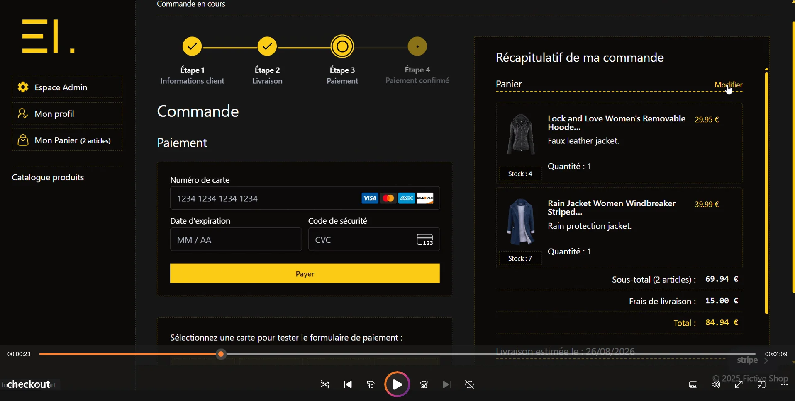
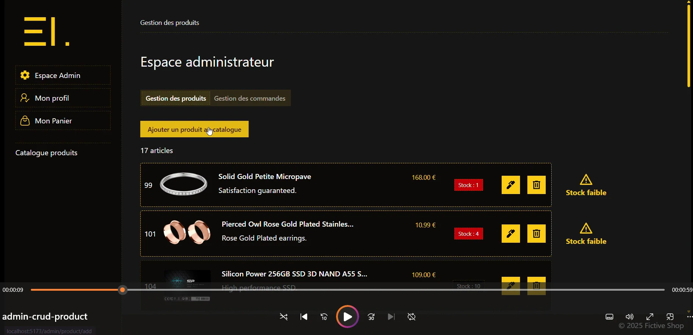

# Boutique e-commerce demo

Boutique e-commerce fictive développée avec **Vue 3**, **Supabase** et **Stripe**.

Ce projet, qui constitue ma première expérience de développement full-stack, est né de l'envie d'approfondir ma compréhension de **Vue.js** sans utiliser de framework comme **Nuxt**, de me familiariser avec **Vue Router** et de renforcer ma pratique de **JavaScript** et **TypeScript**.

En choisissant de développer une boutique en ligne, j'ai pu concevoir une application complète en définissant ses règles métier. Au fil du développement, le projet s'est progressivement enrichi avec des fonctionnalités qui n'étaient pas prévues initialement, comme une interface d'administration pour gérer le catalogue, un parcours de paiement fonctionnel ou encore une architecture backend permettant de centraliser la logique métier.

---

## Objectif du projet

Ce projet a été conçu afin d'explorer plusieurs problématiques rencontrées dans une application e-commerce :

- Authentification sécurisée
- Gestion des paiements avec Stripe
- Synchronisation en temps réel du catalogue et des stocks
- Centralisation de la logique métier dans des Supabase Edge Functions
- Transactions atomiques avec PostgreSQL
- Protection contre les traitements multiples (idempotence)
- Snapshot des commandes pour garantir leur intégrité dans le temps

---

## Aperçu

|                                                                                         Catalogue                                                                                          |                                                                                       Checkout                                                                                       |                                                                                                      Administration                                                                                                       |
| :----------------------------------------------------------------------------------------------------------------------------------------------------------------------------------------: | :----------------------------------------------------------------------------------------------------------------------------------------------------------------------------------: | :-----------------------------------------------------------------------------------------------------------------------------------------------------------------------------------------------------------------------: |
| [](https://fictive-shop.vercel.app/demo/videos/catalog.mp4)<br>Consultation du catalogue et synchronisation des stocks en temps réel. | [](https://fictive-shop.vercel.app/demo/videos/checkout.mp4)<br>Panier, choix de livraison et parcours de paiement avec Stripe. | [](https://fictive-shop.vercel.app/demo/videos/admin-crud-product.mp4)<br>Gestion du catalogue : création, modification et suppression des produits. |

---

## Démo en ligne

Une version de démonstration est disponible en ligne :

https://fictive-shop.vercel.app/

Cette démo utilise Vercel pour le frontend et Supabase Cloud pour les services backend.

L'instance Supabase peut être mise en pause après une période d'inactivité. Si la démonstration n'est temporairement plus accessible, n'hésitez pas à me contacter afin que je puisse la réactiver.

---

## Structure du projet

Le projet est organisé sous forme d'un monorepo pnpm :

```text
shop/
├── frontend/    # Application Vue.js
├── shared/      # Code partagé (types, services, utilitaires…)
├── supabase/    # Migrations, Edge Functions et configuration Supabase
└── pnpm-workspace.yaml
```

---

# Installation

## Prérequis

- Node.js 24+
- pnpm
- Docker Desktop (doit être démarré avant l'utilisation de Supabase en local)
- Supabase CLI
- Stripe CLI

## Installation

```bash
# Cloner le projet
git clone https://github.com/elo-tidy/shop.git
cd shop

# Installer les dépendances
pnpm install

# Démarrer l'environnement Supabase local
supabase start

# Initialiser la base de données (migrations + seed)
supabase db reset

# Démarrer les Edge Functions
supabase functions serve

# Dans un second terminal, lancer l'application frontend
cd frontend
pnpm dev
```

L'application est alors accessible sur :

```text
http://localhost:5173
```

## Variables d'environnement

### Frontend

Créer un fichier frontend/.env avec les variables suivantes :

```env
VITE_SUPABASE_URL=
VITE_SUPABASE_PUBLISHABLE_KEY=
VITE_STRIPE_PUBLISHABLE_KEY=
VITE_STRIPE_TEST_ASSISTANT=
```

Après l'exécution de supabase start, les informations de connexion locales Supabase sont disponibles dans le terminal ou via :

```bash
supabase status
```

### Edge Functions

Créer un fichier supabase/functions/.env avec les variables suivantes :

```env
# Supabase
SB_JWT_ISSUER=
SUPABASE_URL=
SUPABASE_SERVICE_ROLE_KEY=

# CORS configuration
CORS_ALLOWED_ORIGINS=

# Stripe
STRIPE_SECRET_KEY=
STRIPE_WEBHOOK_SECRET=
```

## Paiement Stripe en local

Pour tester les paiements en local, lancer le listener Stripe :

```bash
docker run --rm -it -e STRIPE_API_KEY=<YOUR_STRIPE_SECRET_KEY> stripe/stripe-cli listen --forward-to host.docker.internal:55321/functions/v1/stripe-webhook
```

---

# Stack technique

## Frontend

- Vue.js 3
- Composition API
- Pinia
- Vue Router
- Tailwind CSS
- shadcn-vue

## Backend

- Supabase
    - PostgreSQL
    - Authentication (Magic Link)
    - Row Level Security (RLS)
    - Realtime
    - Edge Functions (Deno)
    - RPC PostgreSQL
    - Triggers

## Paiement

- Stripe
    - Payment Intents
    - Webhooks

## Outils

- Docker
- Supabase CLI
- Stripe CLI

---

# Fonctionnalités

## Catalogue

- Affichage des produits
- Synchronisation automatique des modifications du catalogue
- Mise à jour du stock en temps réel

Les produits sont stockés dans un store Pinia puis synchronisés automatiquement grâce à Realtime.

---

## Authentification

Connexion via **Supabase Auth** en utilisant le système **Magic Link**.

Lorsqu'un utilisateur se connecte pour la première fois, un trigger PostgreSQL crée automatiquement son profil dans la table profiles.

Le profil est initialisé avec :

- l'identifiant utilisateur Supabase
- le nom renseigné lors de l'inscription
- un rôle par défaut (user) ;
- la date de création du profil.

Une authentification est requise avant toute validation de commande.

---

## Gestion du panier

Le panier est entièrement géré côté client avec Pinia.

L'utilisateur peut :

- ajouter ou supprimer des produits
- modifier les quantités
- changer le mode de livraison

autant de fois qu'il le souhaite.

Le bouton **Ajouter au panier** est automatiquement désactivé lorsqu'un produit a atteint sa limite de stock disponible.

---

## Passage de commande

Lors de la validation du panier, une commande est créée à l'étape de paiement du checkout.

Cette étape permet de :

- vérifier les informations du panier
- enregistrer les données nécessaires au paiement
- préparer le suivi du cycle de vie de la commande

Les données de commande sont ensuite utilisées pour synchroniser le paiement Stripe et la validation finale via webhook.

---

## Paiement

Le projet utilise les **Payment Intents Stripe**.

Le Payment Intent est créé une seule fois puis conservé pendant tout le processus de paiement.

Lorsqu'une commande est modifiée :

- le montant est mis à jour
- les métadonnées Stripe sont synchronisées

Cette approche évite la création de multiples Payment Intents inutiles.

La validation du paiement repose exclusivement sur les **Webhooks Stripe**.

Le **Stripe Test Assistant** est activé par défaut dans le dépôt afin de faciliter les tests en développement.

Il peut être désactivé via la variable d'environnement `VITE_STRIPE_TEST_ASSISTANT`.

Pour la démonstration en ligne, cette variable est désactivée afin de conserver une interface de paiement plus proche d'un parcours utilisateur réel.

```env
VITE_STRIPE_TEST_ASSISTANT=false
```

---

## Administration

Une interface d'administration permet de gérer les produits.

Fonctionnalités disponibles :

- création
- modification
- suppression

Toutes les opérations transitent par des Edge Functions qui effectuent les validations nécessaires avant toute modification de la base.

L'accès au dashboard est protégé par une vérification des droits administrateur côté serveur.

Pour accéder au dashboard administrateur en environnement local :

- Se connecter via Magic Link.
- Récupérer l'utilisateur créé dans la table profiles.
- Modifier son rôle en remplaçant la valeur user par admin.

Une fois le rôle administrateur attribué, l'utilisateur peut accéder aux fonctionnalités d'administration.

Pendant la vérification des droits, un Skeleton Loader est affiché afin d'améliorer l'expérience utilisateur.

---

# Architecture et choix techniques

## Synchronisation temps réel

Supabase Realtime permet de synchroniser automatiquement :

- les stocks
- les modifications de produits
- les créations
- les suppressions

Les utilisateurs visualisent ainsi un catalogue toujours à jour sans rechargement de la page.

## Snapshot des commandes

Lors du passage à l'étape de paiement, une commande est enregistrée en base sous forme de **snapshot**.

Chaque commande contient une copie figée des informations des produits.

Ainsi, toute modification future du catalogue (prix, suppression, changement de stock...) n'impacte jamais les commandes déjà enregistrées.

## Synchronisation panier / commande

Lorsque l'utilisateur revient sur l'étape de paiement :

- le panier local est comparé à la commande enregistrée en base ;
- si une différence est détectée, une Edge Function met automatiquement à jour le snapshot.

Le paiement correspond ainsi toujours à l'état réel du panier.

## Validation métier côté serveur

Toutes les opérations sensibles sont réalisées dans des **Edge Functions**.

Avant chaque création ou mise à jour d'une commande, plusieurs vérifications sont effectuées :

- existence des produits
- disponibilité du stock
- validité du transporteur
- recalcul du montant
- recalcul des frais de livraison
- estimation de livraison

Le frontend ne décide jamais de la validité d'une commande.

## Gestion du stock

Le stock est décrémenté uniquement après confirmation du paiement.

La mise à jour est réalisée directement en base via une requête SQL atomique afin d'éviter les problèmes de concurrence.

## Traitement atomique des commandes

À la réception du webhook Stripe, une RPC PostgreSQL exécute une transaction unique qui :

- verrouille la commande
- vérifie l'idempotence
- valide le Payment Intent
- décrémente le stock
- contrôle la disponibilité des produits
- met à jour le statut de la commande

Cette approche garantit qu'une commande ne peut être traitée qu'une seule fois, même si Stripe renvoie plusieurs fois le même webhook.

## Sécurité

Le projet applique plusieurs mécanismes destinés à sécuriser les traitements sensibles :

- Authentification via Magic Link
- Vérification des droits administrateur
- Row Level Security (RLS)
- Validation métier côté serveur
- Vérification de la signature des Webhooks Stripe

---

# Évolutions / TODO

## Gestion des commandes

- Gestion des commandes et paniers abandonnés (`draft`)
    - Reprise d'un panier existant
    - Suppression automatique des paniers expirés

- Dashboard administrateur
    - Gestion des commandes et modification du statut des commandes
    - Envoi automatique d'un e-mail de confirmation de commande
    - Notifications e-mail à chaque changement de statut
    - Ajout d'un lien de suivi de livraison

- Dashboard utilisateur
    - Historique des commandes
    - Consultation des commandes en cours
    - Suivi de l'état des livraisons

---

## Livraison

- Ajout des points relais comme mode de livraison

---

## Catalogue

- Tri des produits : prix / popularité / ordre alphabétique
- Recherche instantanée avec filtre dynamique
- Pagination des produits

---

## Profil utilisateur

- Modification du profil utilisateur
- Gestion des informations client (actuellement figées lors de la première étape du checkout)

---

## Qualité

- Mise en place de tests unitaires
- Mise en place de tests End-to-End (Playwright ou Cypress)
